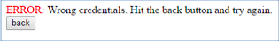
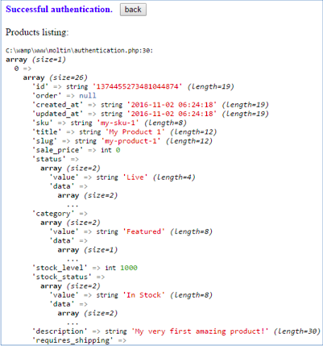

**- TUTORIAL -**

**A small PHP web application that interacts with the moltin API**

**github link:** <https://github.com/adajic1/Moltin_authentication_tutorial>

**Downloading and installing the PHP-SDK**

**\_\_\_\_\_\_\_\_\_\_\_\_\_\_\_\_\_\_\_\_\_\_\_\_**

**Step 1: Install Composer**

The recommended way to install the SDK is to use a program called Composer to
manage installation and creation of the autoload script. The latest version of
Composer can be downloaded from the website: <https://getcomposer.org/download/>

If you already have an older version of Composer, you can update it to the
latest version by running this command in a terminal:

composer self-update

After successful installation, Composer will be added to the environment PATH
and it should be visible from any directory (PHP should be visible from any
directory too). You can test it if you run commands:

php -v

composer -v

**Step 2: Create a moltin directory**

Just create a folder with a name: “moltin“ in your www folder. For example, if
you are using wamp server on Windows, the full path to the directory will be
'C:\\wamp\\www\\moltin'.

**Step 3: Install the Moltin PHP-SDK**

Open Terminal, then navigate to the Moltin directory created in the previous
step. After that, run the following command to download and install the Moltin
PHP-SDK:

composer require moltin/php-sdk

Composer might ask you to input a GitHub token, which you can obtain from the
following link:
<https://github.com/settings/tokens/new?scopes=repo&description=Composer>

If you have done everything correctly, a new directory moltin/vendor will
appear.

**Your first authorization with moltin**

For this tutorial we will use Client Credentials authorization. It is the
easiest grant type to get started with. It is designed to grant access to your
own store using your client\_id and secret. This grant type is designed to be
used on your storefront and does not require you to redirect or login. To
authorize with client credentials you simply need to post your client\_id and
client\_secret to the link: <https://api.molt.in/oauth/access_token>

If all goes well then you will receive a response with your access token.

**Resource URL**

POST <https://api.molt.in/oauth/access_token>

**Parameters**

| **Key**            | **Type**   | **Description**           | **Value**               |
|--------------------|------------|---------------------------|-------------------------|
| **grant\_type**    | **String** | **The grant type to use** | **client\_credentials** |
| **client\_id**     | **String** | **Your client id**        |                         |
| **client\_secret** | **String** | **Your client secret**    |                         |

EXAMPLE SUCCESSFUL RESPONSE

{

"access\_token": "7LKQe9urWbIGYf7WCjqteljYgy9KrL1aayJl2sQq",

"token\_type": "Bearer",

"expires": 1385050869,

"expires\_in": 3600

}

A typical way to interact with the web API is to use cURL. It is a computer
software project providing a library and command-line tool for transferring data
using various protocols. cURL functions are typically enabled and can be called
from PHP. Instead of such a manual programming, we will use the Moltin PHP-SDK
which we already installed. The web application will ask a user to insert his
credentials. Data will be submitted to a PHP script which will try to authorize
the user using the Moltin PHP-SDK. If it's successful, it will print a message
**Successful authentication,** and show a listing of all products from the
store. In case of wrong credentials it will print a message: **ERROR:** Wrong
credentials.

**Step 1: Create a HTML form**

Create a new empty file: moltin/index.html

Put the following code into the file:

1.  **\<!DOCTYPE html\>**

2.  **\<html\>**

3.  **\<head\>**

4.      **\<title\>**Authentication**\</title\>**

5.      **\<meta http-equiv=**"content-type" **content=**"text/html;
    charset=utf-8"**\>**

6.      **\<meta name=**"description" **content=**"Authentication
    form"**\>**    

7.  **\</head\>**

8.  **\<body style=**"margin: 5px; padding: 10px;"**\>**

9.      **\<center\>**

10.     **\<h2 style=**"display: inline;"**\>**Moltin API authentication
    demo**\</h1\>**

11.     **\<br\>**

12.     Test your credentials for authentication

13.     **\</center\>**

14.     **\<form action=**"authentication.php" **method=**"post"**\>**

15.         client\_id:**\<br\>\<input type=**"text" **name=**"client\_id"
    **size=50\>**

16.         **\<br\>**

17.         client\_secret:**\<br\>\<input type=**"text"
    **name=**"client\_secret" **size=50\>**

18.         **\<br\>\<input type=**"submit" **value=**"Submit"**\>**

19.     **\</form\>\<br\>\<br\>**

20.     Example values:**\<br\>**

21.     **\<table cellspacing=**"0" **cellpadding=**"10" **border=**"1"**\>**

22.     **\<tr\>**

23.         **\<td\>**client\_id:**\</td\>\<td\>**ECCYbXzj9csBQZnVJhR5B5UXOoFhHiYI3qTMSzkqEX**\</td\>**

24.     **\</tr\>**

25.     **\<tr\>**

26.         **\<td\>**client\_secret:**\</td\>\<td\>**DfXd2yUn41Ved8wnjhG11HYJt0Ah79Y1LNJtq107KH**\</td\>**

27.     **\</tr\>**

28.     **\</table\>**

29. **\</body\>**

30. **\</html\>**

It is a simple HTML form which has two fields: “client\_id” and “client\_secret”
required for authentication. It submits data to “authentication.php”. If you
open the moltin/index.html in a browser, you should see the following:

**Step 2: Create a PHP script for authentication**

Create a new empty file: moltin/authentication.php

Put the following code into the file:

1.  **\<?php**

2.  error\_reporting**(**E\_ALL **& \~**E\_NOTICE**);**

3.  **require** \_\_DIR\_\_ **.** '/vendor/autoload.php'**;**

4.  **function** getVar**(**$var**) {**

5.      // Safely get the submitted variable (POST or GET method);

6.      // Returns NULL if there is no variable with the specified name;

7.      **if (isset(**$$\_\text{POST}**\lbrack**$$var**]))**

8.          **return** get\_magic\_quotes\_gpc**() ?**
    stripslashes**(**$$\_\text{POST}**\lbrack**$$var**]) :**
    $$\_\text{POST}**\lbrack**$$var**];**

9.      **else if (isset(**$$\_\text{GET}**\lbrack**$$var**]))**

10.         **return** get\_magic\_quotes\_gpc**() ?**
    stripslashes**(**$$\_\text{GET}**\lbrack**$$var**]) :**
    $$\_\text{GET}**\lbrack**$$var**];**

11.     **else return** NULL**;**

12. **}**

13. **use** Moltin**\\**SDK**\\**Request**\\**CURL **as** Request**;**

14. **use** Moltin**\\**SDK**\\**Storage**\\**Session **as** Storage**;**

15. $moltin **= new \\**Moltin**\\**SDK**\\**SDK**(new** Storage**(), new**
    Request**());**

16. try **{**    

17.     $result **=** Moltin**::**Authenticate**(**'ClientCredentials'**, [**

18.      'client\_id' **=\>** getVar**(**'client\_id'**),**

19.      'client\_secret' **=\>** getVar**(**'client\_secret'**)**

20.     **]);**

21.     **if (**$result **==** true**) {**

22.      **?\>**

23.         **\<**font color**=**'blue'**\>\<**b**\>**Successful
    authentication**.\</**b**\>\</**font**\>**

24.         **&**nbsp**;**

25.         **\<**input type**=**"button" value**=**"back"
    onclick**=**"window.location = 'index.html';"**\>**

26.         **\<**br**\>\<**br**\>**

27.         Products listing**:\<**br**\>**        

28.         **\<?php**

29.         $products **=** Product**::**Listing**();**

30.         var\_dump**(**$products**['result']);**

31.     **} else {**

32.         **?\>**

33.         **\<**font color**=**'red'**\>**ERROR**: \</**font**\>**Wrong
    credentials**.**

34.         Hit the back button **and** try again**.**

35.         **\<**br**\>**

36.         **\<**input type**=**"button" value**=**"back"
    onclick**=**"window.location = 'index.html';"**\>**

37.         **\<**br**\>\<**br**\>**

38.         **\<?php**        

39.     **}**

40. **}** catch **(**Exception $e**) {**

41. **print** "\Caught exception:
    \</font\>"**.**$e**-\>**getMessage**();**

42. **}**

43. session\_unset**();**

44. **?\>**

**Code explanation**

*Line 2:*

*error\_reporting(E\_ALL & \~E\_NOTICE);*

This means that PHP will display all syntax errors and warnings, except notices.
In the case of wrong credentials, the Moltin PHP-SDK would show some notices
which we don't want to display.

*Line 3:*

*require \_\_DIR\_\_ . ‘/vendor/autoload.php’;*

Command which will load the Moltin PHP-SDK.

*Lines 4-12:*

*function getVar($var) {*

    *// Safely get the submitted variable (POST or GET method);*

    *// Returns NULL if there is no variable with the specified name;*

    *if (isset($\_POST[$var]))*

        *return get\_magic\_quotes\_gpc() ? stripslashes($\_POST[$var]) :
$\_POST[$var];*

    *else if (isset($\_GET[$var]))*

        *return get\_magic\_quotes\_gpc() ? stripslashes($\_GET[$var]) :
$\_GET[$var];*

    *else return NULL;*

*}*

This is a function which can be used to get the submitted variable by name. It
doesn't matter which method was used to send the variable (POST or GET). It will
return NULL if there is no variable with the specified name.

*Lines 13-14:*

*use Moltin\\SDK\\Request\\CURL as Request;*

*use Moltin\\SDK\\Storage\\Session as Storage;*

These lines allow us to use shorter syntax for cURL requests, and for accessing
the Storage class.

*Line 15:*

*$moltin = new \\Moltin\\SDK\\SDK(new Storage(), new Request());*

This line of code will create a Moltin object, load cookies, set some default
variables etc. This is the main object which provides an interface for the
Moltin PHP-SDK.

*Lines 16-42:*

Try-catch block. All exceptions from the 'try' block of code will be captured
and printed to the user. If anything unexpected happens, functions could throw
an exception during execution of code from the 'try' block.

*Lines 17-19:*

*$result = Moltin::Authenticate('ClientCredentials', [*

*'client\_id' =\> getVar('client\_id'),*

*'client\_secret' =\> getVar('client\_secret')*

*]);*

This code calls a static 'Authenticate' function from the Moltin object and
retrieves an access token internally. The first argument is a string:
'ClientCredentials' (authorization method) and the second argument is an array
with credentials data obtained by previously defined function 'getVar'. The
$result variable is either true (in case of successful authentication) or false
(in case of wrong credentials).

*Lines 21-31:*

*if ($result == true) {*

    *?\>*

    *\\<b\>Successful authentication.\</b\>\</font\>*

    *\&nbsp;*

    *\<input type="button" value="back" onclick="window.location = 'index.html';"\>*

    *\<br\>\<br\>*

    *Products listing:\<br\>*

    *\<?php*

    *$products = Product::Listing();*

    *var\_dump($products['result']);*

*}*

This part of code will execute in case of successful authentication. It will
print the message, a 'Back' button and products listing.

*Lines 29-30:*

*$products = Product::Listing();*

*var\_dump($products['result']);*

Product::Listing() will use the access token (internally), call the remote
Moltin API to retrieve all products' data and print it using the standard
var\_dump() function.

*Lines 31-39:*

>*else {*

>    *?\>*

>    *\ERROR: \</font\>Wrong credentials.*

>    *Hit the back button and try again.*

>    *\<br\>*

>    *\<input type="button" value="back" onclick="window.location =
>'index.html';"\>*

>    *\<br\>\<br\>*

>    *\<?php*

>*}*

These lines of code will execute in case of wrong credentials. It will print the
ERROR message and a 'Back' button.

*Line 43:*

*session\_unset();*

This command should be commented out as it will delete cookies (which means it
will delete the access token obtained during authorization as well). So, next
time the PHP script is called, it will have to do the authorization call again.
If we don't want that, just comment out this line by adding two slashes in front
of it '//'.

**Results**

In case of wrong credentials we get:

In case of right credentials and successful authentication we get:

In your final web store application you should just set credentials as PHP
variables (never pass these credentials through forms, because it's not safe.
It's done here that way just for demonstration purpose). On the other hand, data
for accessing products, cart, taxes and categories can be passed through forms
in order to edit, delete or add new elements. This will be covered in other
tutorials.
